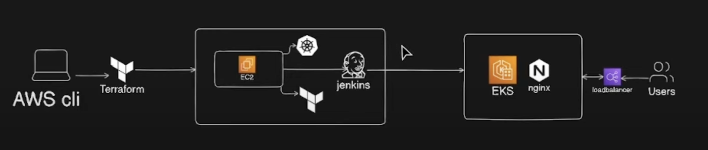

# Automating EKS Cluster Deployment and Nginx Application Deployment with Terraform and Jenkins CI/CD Pipeline

Before starting the project we need to have:
- Terraform installed
- AWS account with Access keys
- AWS CLI configured

## Step 1: Creating an EC2 instance and deply Jenkins on it using Terraform (Jenkins-server repo)
- We define first the provider AWS to communicate with Terraform
- We define the Backend where our artifcats are going to store ( S3 Bucket)
- Initialize Terraform to check the configuration: #Terraform init
- Then in Data file we need to define an AMI to be used for EC2 creation
- Then we define in Main VPC, Security Group and EC2 instances and necessary variables (variables file define variables with thier types where terraform.ftvars define the values of the variables
- We create Jenkins-install.sh file and pass it as user-data to the EC2 for installing: Jenkins, terraform, Kubernetes and AWS CLI
- Then we initialize again Terraform, plan and apply to create resources.
## Step 2: Creating EKS Cluster using Terraform (AWS-EKS)
## Step 3: Creation of Jenkins Pipeline (EKS Cluster)
## Step 4: Implenting Deployment files (Kubctl)
## Step 5: Deploying changes to AWS
